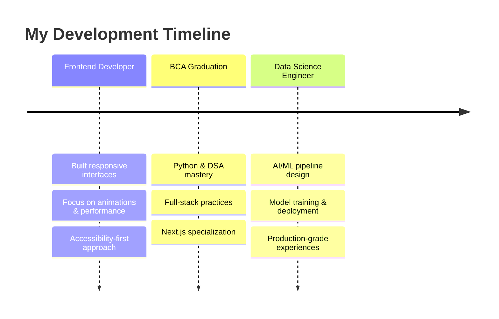

  
# 👋 Hey, I'm Sujan Das

**Blending AI/ML with delightful, high-performance frontends**

---

## 🎯 What I Do

> **I turn ideas into intelligent, production-grade experiences** — from ML models to polished UIs that feel effortless.

  
🤖 **AI/ML Engineering** • 🌐 **Web Development** • 📊 **Data Science** • ⚡ **Automation & APIs**

---

## 🛠️ Tech Arsenal

  

**Core:** Python, TypeScript, JavaScript  
**Frontend:** Next.js, React, Tailwind CSS, Framer Motion  
**Backend:** FastAPI, PostgreSQL, REST APIs  
**AI/ML:** TensorFlow, scikit-learn, Pandas, NumPy  

---

## 🚀 Featured Projects

| Project | Live | Tech | Description |
|---------|------|------|-------------|
| **🎯 Moneytany** | [Demo](https://moneytany.sujandas.info/) | Next.js, PWA | Finance tracker with real-time insights |
| **📊 AnlystoX** | [Demo](https://anlystox.vercel.app/) | React, Data Viz | Stock portfolio dashboard |
| **🎓 Ed-Flourish** | [Demo](https://ed-flourish.vercel.app/) | AI/ML, Next.js | AI-powered learning platform |

[🔗 **View All Projects**](https://www.sujandas.info/project)

---

## 🌟 Professional Journey

---

## 💡 Current Focus

🔬 Advanced ML deployment & MLOps  
🎯 Data-driven web applications  
🌱 Cutting-edge AI optimization  
🤝 Open for freelance & remote work  

---

## 📬 Let's Connect

**Ready to build something meaningful together?**

---

### *"Code with purpose, design with empathy, innovate with impact."*

---

## 📊 GitHub Analytics

  

  

  

**Made with ❤️ and way too much coffee ☕**

