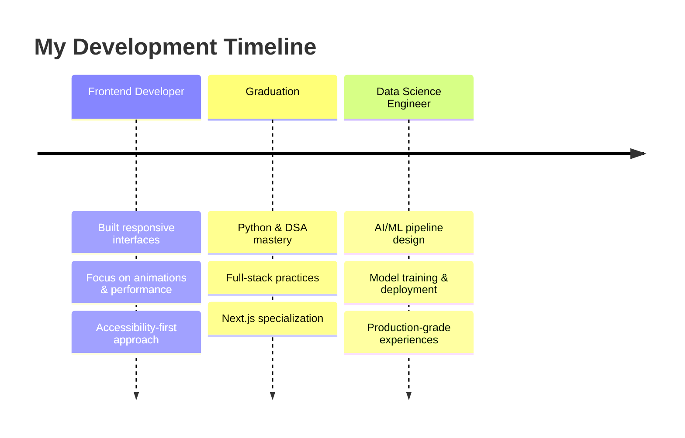

<h1 style="color:#00D4FF; font-size:56px; font-weight:1200; margin-bottom:10px;">
  Sujan Das
</h1>

<strong>Transforming ideas into elegant, performant web experiences</strong>

  

---
##  What I Do

> **I build fast, scalable, and visually refined web applications** — where clean code meets thoughtful design.

  
<strong>Frontend Architecture</strong> • <strong>UI / UX Engineering</strong> • <strong>Full-Stack Web Applications</strong> • <strong>Performance Optimization</strong>

---

##  Tech Arsenal

  

---

##  Professional Journey

```mermaid
timeline
    title My Development Timeline
    
    Frontend Developer    : Built responsive interfaces
                          : Focus on animations & performance
                          : Accessibility-first approach
    
    Graduation       : Python & DSA mastery
                         : Full-stack practices
                         : Next.js specialization
    
    Data Science Engineer : AI/ML pipeline design
                          : Model training & deployment
                          : Production-grade experiences
```

---

##  Current Focus

• Building scalable, production-ready web applications  
• Advanced Next.js patterns & frontend architecture  
• Performance optimization and user experience refinement  
• Open to freelance projects and remote opportunities  

---

##  Let's Connect

**Ready to build something meaningful together?**

---

### *"Code with purpose, design with empathy, innovate with impact."*

---

**Made with ❤️ and way too much coffee ☕**

